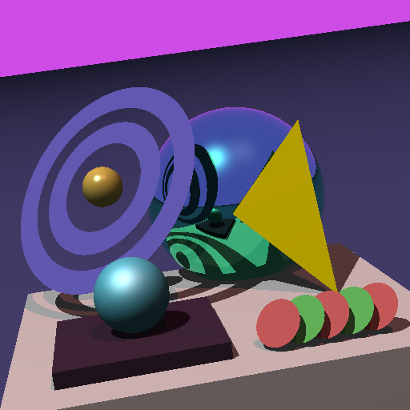
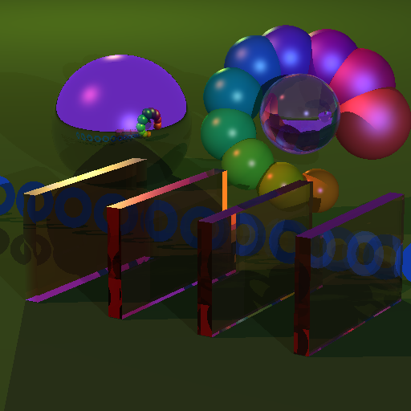
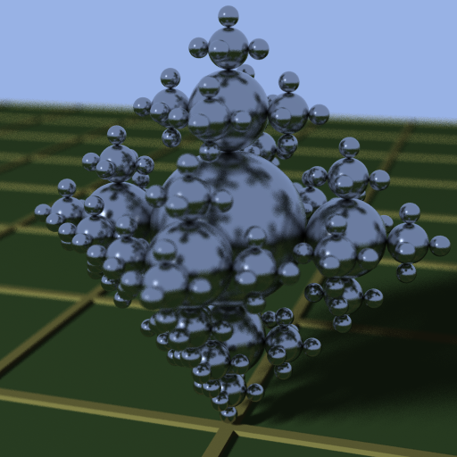

# Old college project ray tracer

I haven't read the ray tracing in one weekend yet https://raytracing.github.io/

But I did take Peter Shirley's class at the University of Utah in ~2010. It was one of my favorite classes, and I've always wanted to make this old code work again.

Each project folder has some instructions to get it running. The instructions also assume you have a machine configured for cpp dev. project{N} is a copy-paste of project{N-1}, with new features.

  
  

  
  

