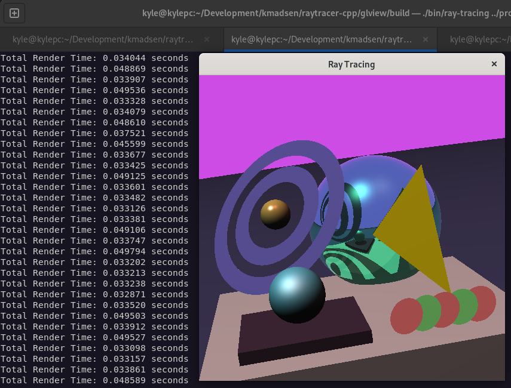

## About

Setting up an old ray-tracer project to work that I built in college.

Final project - hybrid with opengl.

## Building

``` bash
$ cd project04
$ mkdir build
$ cd build
$ cmake ..
$ make
```

## Running

``` bash
$ cd project04
$ ./build/bin/ray-tracing prog04.scn
$ eog image.ppm
```

## Output

<div class="card">
  <div class="card-image">
    
  </div>
</div>
