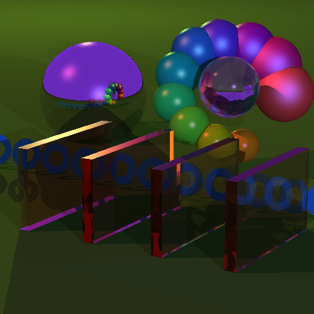

## About

Setting up an old ray-tracer project to work that I built in college.

Project 2 included an OpenGL viewer, but I deleted it. Creating a better viewer can be considered a future project.

## Building

``` bash
$ cd project02
$ mkdir build
$ cd build
$ cmake ..
$ make
```

## Running

``` bash
$ cd project02
$ ./build/bin/ray-tracing prog02.scn 
$ eog image.ppm
```

## Output

<div class="card">
  <div class="card-image">
    
  </div>
  <div class="card-action">
    <a href="prog02.scn">Open scene file</a>
  </div>
</div>
